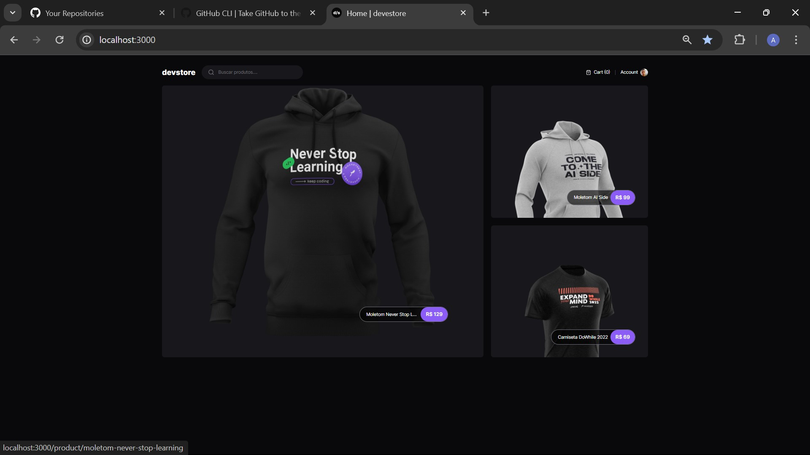
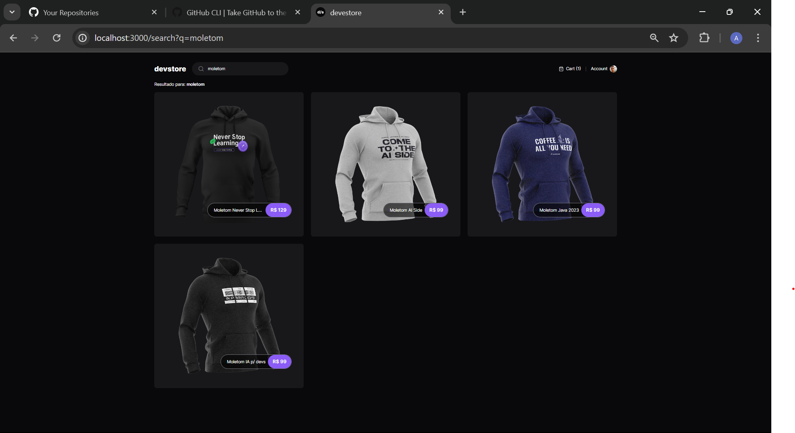

# E-commerce

## Ferramentas
- Aplicação usando Next.js
- Usando Tailwindcss
- Usando Cypress

## Rodar o projeto

- primeiro instalar o nodejs versão LTS
- npm install para instalar todas as dependência
- npm run dev
